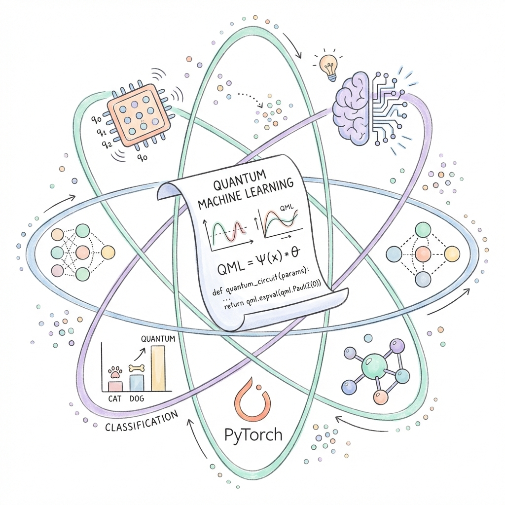
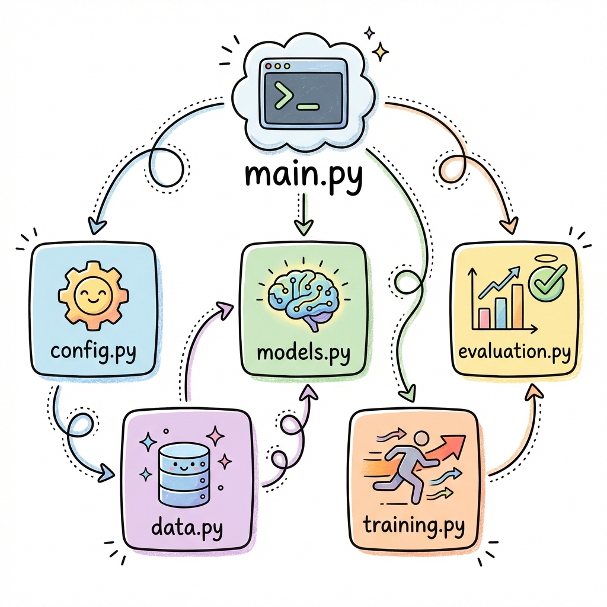
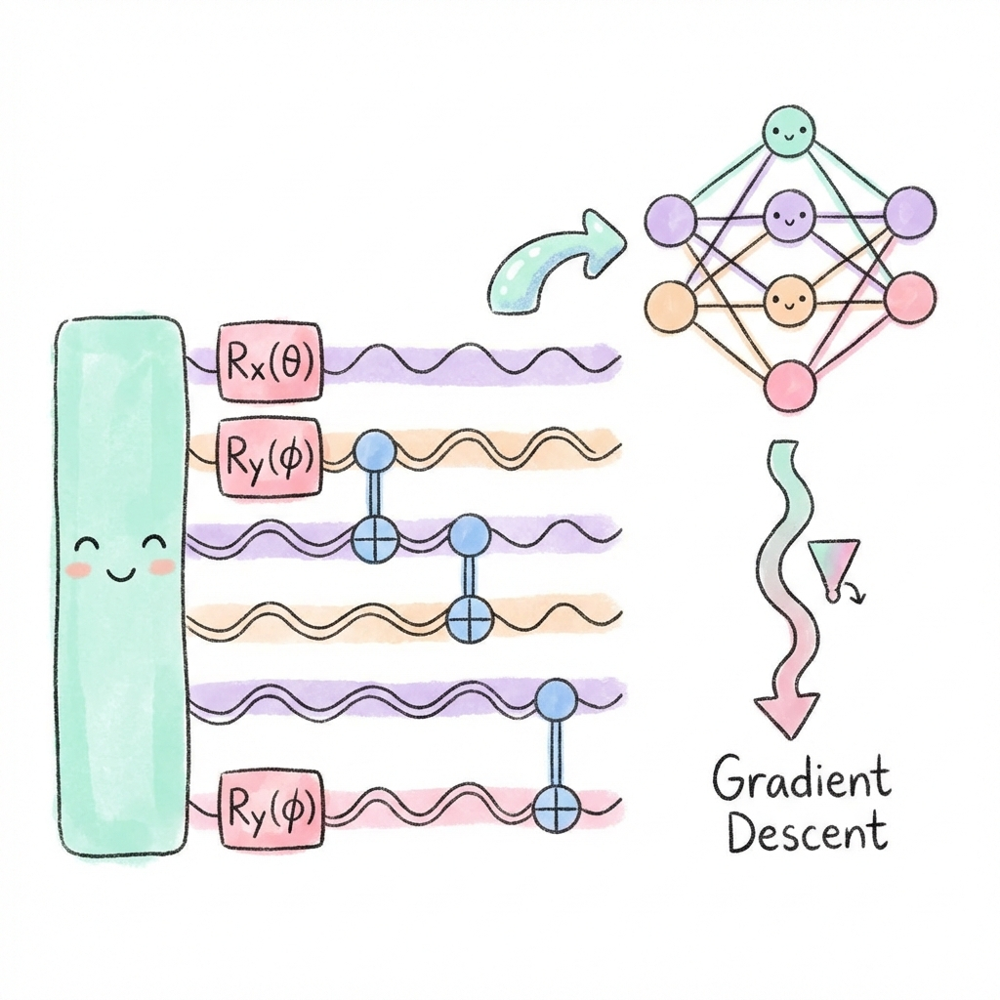
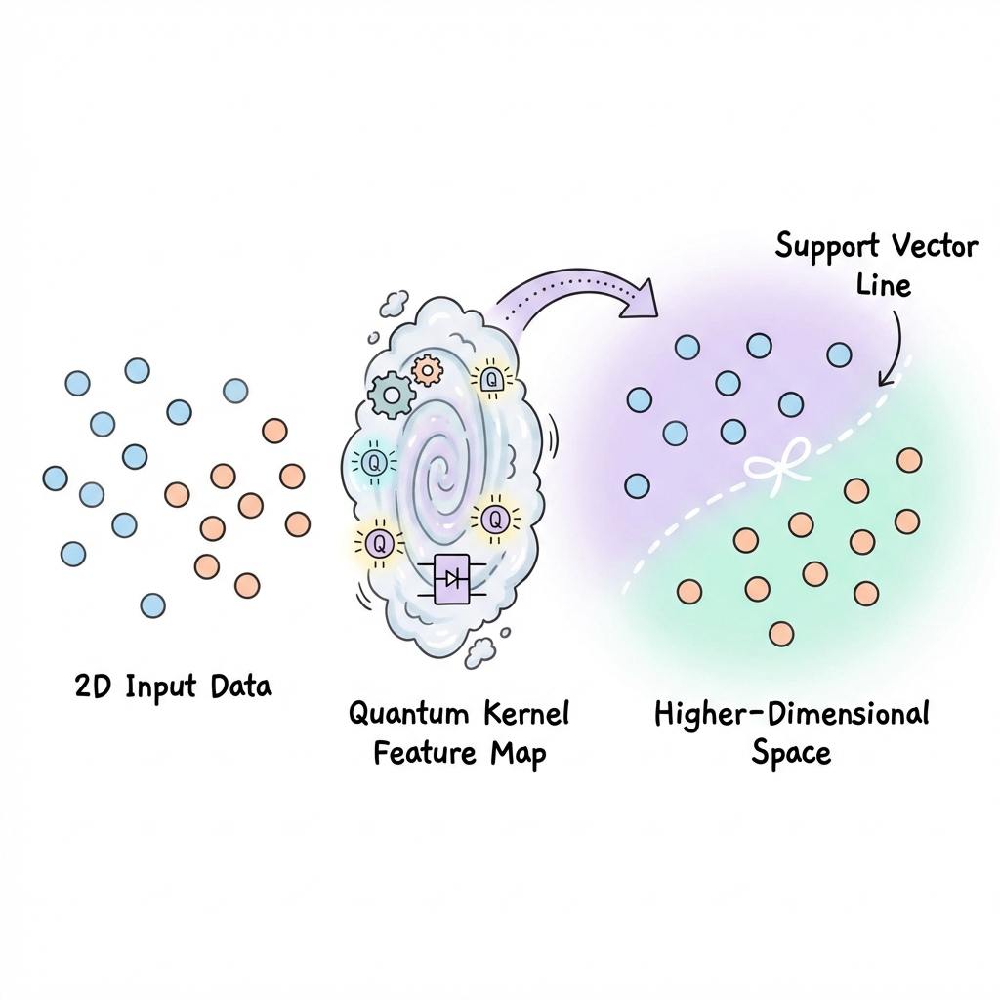
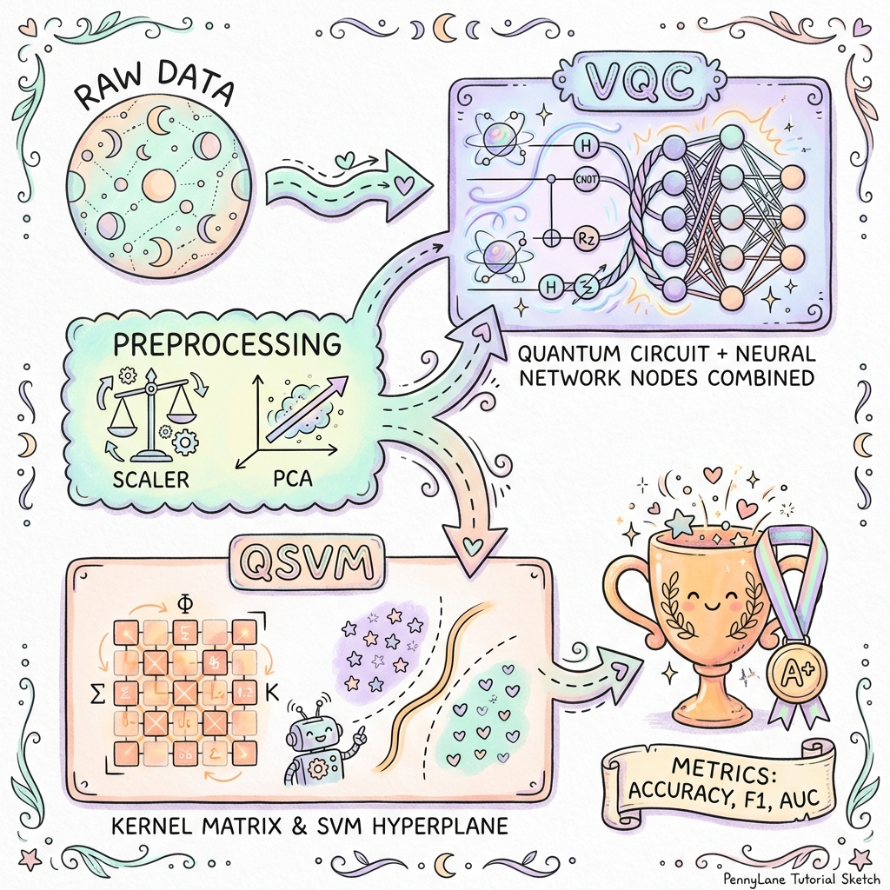
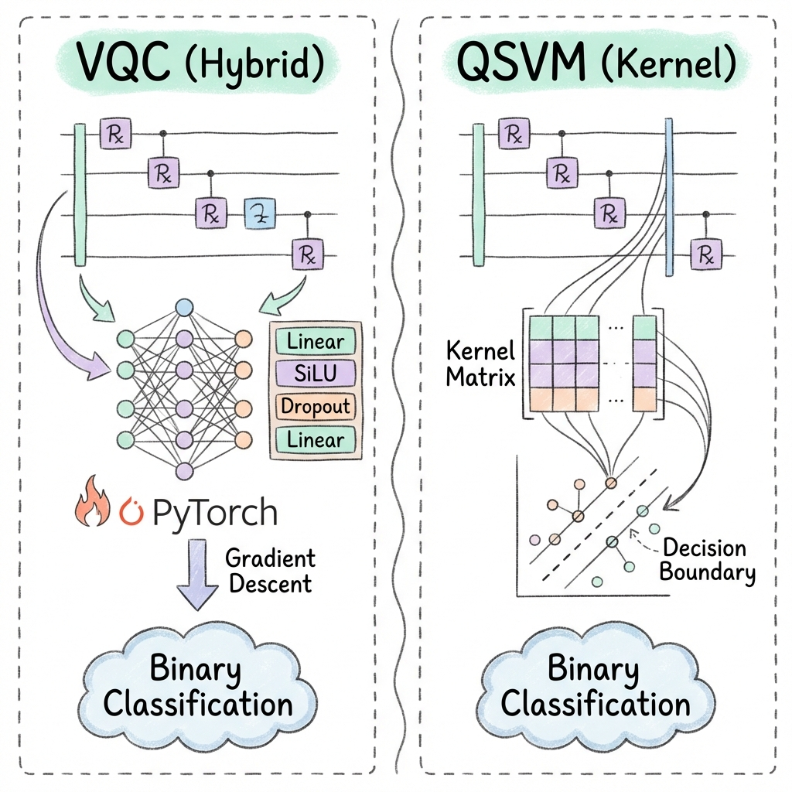
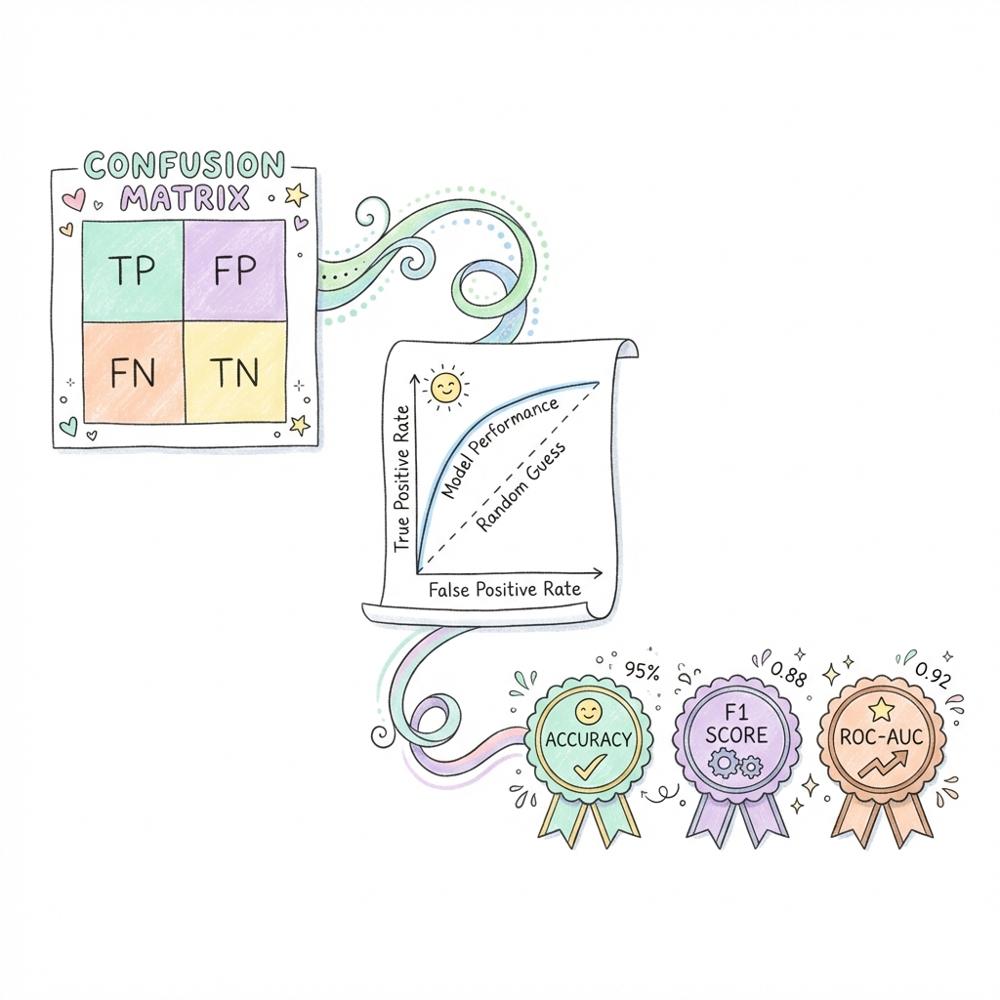

# Quantum Machine Learning: Hybrid VQC vs. Quantum Kernel SVM

[](https://www.python.org/)
[](https://pytorch.org/)
[](https://pennylane.ai/)
[](https://qiskit.org/)
[](https://opensource.org/licenses/MIT)


<p align="center">
  
</p>

---

# Overview

This repository hosts an Advanced Quantum Machine Learning (QML) project designed for rigorous comparative analysis and reproducible research. It implements and benchmarks two leading NISQ-era paradigms:

**Hybrid Variational Quantum Classifier (VQC):** A trainable quantum-classical hybrid model optimized end-to-end using PyTorch and PennyLane.

**Quantum Kernel Support Vector Machine (QSVM):** A kernel-based model utilizing quantum feature maps from PennyLane and Qiskit, interfaced with a classical SVM from scikit-learn.

**Status:** Active Research & Development / Reproducible Benchmarking Framework  
**Primary Goal:** To provide a statistically grounded, open-source comparison of VQC and QSVM stability and performance on binary classification tasks, emphasizing reproducibility and cross-platform execution.

---

## Technology Stack & Framework Components

| Component                   | Library/Framework                | Description                                  |
|-----------------------------|----------------------------------|----------------------------------------------|
| **VQC Training/Evaluation** | PyTorch, PennyLane               | Backpropagation and quantum differentiation  |
| **QSVM Training/Evaluation**| PennyLane, Qiskit, Scikit-learn  | Quantum kernel computation & classification  |
| **CLI Interface & Logging** | Typer, Rich                      | Clean command execution and formatted logs   |
| **Configuration Management**| PyYAML                           | Configurable experiment parameters           |
| **Numerical Processing**    | NumPy                            | Data preprocessing                           |

---

## Methodology & Model Architecture

<p align="center">
  
</p>

### Hybrid Variational Quantum Classifier (VQC)

<p align="center">
  
</p>

- **Architecture**: `HybridVariationalClassifier` (in `models.py`) combines a quantum layer implemented with `pennylane.QNode` and classical layers via `torch.nn.Module`.
- **Ansatz**: `build_variational_circuit` (in `qnn_layers.py`) implements a configurable Hardware-Efficient Ansatz.
- **Optimization**: `train_variational_model` (in `training.py`) uses `torch.optim.Adam`.
- **Execution**: `evaluate_vqc` (in `evaluation.py`) computes final metrics on the test set.

---

### Quantum Kernel Support Vector Machine (QSVM)

<p align="center">
  
</p>

- **Architecture**: `QuantumKernelClassifier` (in `models.py`) integrates `qml.kernels` with `sklearn.svm.SVC`.
- **Feature Map**: `build_kernel_qnode` (in `qnn_layers.py`) defines the `ZZFeatureMap`.
- **Execution**: `evaluate_kernel` (in `evaluation.py`) computes final metrics on the test set.

---

### Main Workflow (in `main.py`)

<p align="center">
  
</p>

- Provides `train` and `evaluate` commands for both models (`vqc`, `kernel`).
- Integrates Typer for the CLI and `seed.py` for global seed configuration.

### VQC vs QSVM Comparison

<p align="center">
  
</p>


---


## Contact & License

- **Author:** Ahmad Rasidi 
- **Email:** rasidi.basit@gmail.com  
- **GitHub:** [https://github.com/rasidi3112](https://github.com/rasidi3112)  

**License:** MIT License  

---

## Project Structure

```plaintex
qml_app/
├─ config/
│  └─ default.yaml
├─ qml_app/
│  ├─ __init__.py
│  ├─ config.py
│  ├─ data.py
│  ├─ evaluation.py
│  ├─ main.py
│  ├─ models.py
│  ├─ qnn_layers.py
│  ├─ training.py
│  └─ utils/
│     ├─ __init__.py
│     ├─ config_utils.py
│     ├─ logging_utils.py
│     └─ seed.py
└─ requirements.txt

```

---


## How To Run

### 1. Clone the Repository

```bash
git clone https://github.com/rasidi3112/Quantum-Machine-Learning.git
cd Quantum-Machine-Learning
```
  
### 2. Create and Activate Virtual Environment

**macOS / Linux:**
```bash
python -m venv .venv
source .venv/bin/activate
```

**Windows:**
```bash
python -m venv .venv
.venv\Scripts\activate
```

### 3. Install Dependencies

```bash
pip install --upgrade pip
pip install -r requirements.txt
```

### 4. Train Models

**a. Hybrid Variational Quantum Classifier (VQC)**
```bash
python -m qml_app.main train --model vqc --config config/default.yaml
```

**b. Quantum Kernel SVM (QSVM)**
```bash
python -m qml_app.main train --model kernel --config config/default.yaml
```

> **Tip:** Modify `config/default.yaml` to change datasets, qubits, layers, batch size, etc.
  

### 5. Evaluate Models

```bash
python -m qml_app.main evaluate --model vqc --config config/default.yaml
python -m qml_app.main evaluate --model kernel --config config/default.yaml
```

<p align="center">
  
</p>

Evaluation results, including metrics and confusion matrices, are saved in `artifacts/`.

### 6. Additional Notes

**Device Selection:**
- Apple M1/M2 → `device: mps`
- NVIDIA GPU → `device: cuda`
- CPU-only → `device: cpu`

**Shots:**
- `shots=null` for analytic/simulated mode (fast, ideal for CPU)
- `shots=1024` or higher for realistic sampling on quantum hardware

**Artifacts:** Check `artifacts/` for trained models, metrics, ROC curves, and confusion matrices.

> **Note:** Adjust `--device` flag in `config/default.yaml` for CPU or GPU.


### 7. Run Additional Scripts

**Kernel folder:**
```bash
# Convert or preprocess data with convert.py
python3 artifacts/kernel/convert.py

# Run custom scripts
python3 artifacts/kernel/script.py
```

**VQC folder:**
```bash
# Convert PyTorch model to JSON format
python3 artifacts/vqc/convert_pt_to_json.py
```

**Generate boxplots for VQC and QSVM results:**
```bash
python generate_boxplots.py
```


