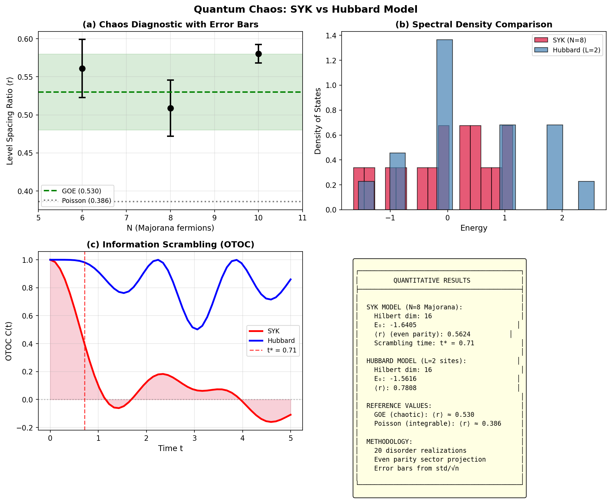

# Quantum Chaos Framework

A Python framework for studying quantum chaos and information scrambling in many-body quantum systems, with focus on the Sachdev-Ye-Kitaev (SYK) model and driven Hubbard model.

[](https://www.python.org/downloads/)
[](https://opensource.org/licenses/MIT)

## Overview

This framework provides tools for:
- Constructing SYK and Hubbard model Hamiltonians via Jordan-Wigner transformation
- Computing spectral statistics for quantum chaos diagnostics
- Calculating Out-of-Time-Ordered Correlators (OTOC) for scrambling analysis
- Simulating Floquet dynamics and quasi-energy spectra
- Quantum kernel methods for machine learning

## Output



## Features

### Hamiltonians
- **SYK Model**: Random all-to-all 4-body Majorana interactions
- **Driven Hubbard Model**: 1D lattice with time-periodic hopping

### Chaos Diagnostics
- Level spacing ratio analysis (GOE/GUE/Poisson classification)
- Fermion parity sector projection
- Disorder averaging with error estimation
- Finite-size scaling extrapolation

### Quantum Dynamics
- OTOC calculation for scrambling timescales
- Trotter-Suzuki decomposition for time evolution
- Floquet operator and quasi-energy computation

### NISQ Simulation
- Depolarizing, amplitude damping, and phase damping channels
- Realistic noise modeling for near-term quantum devices

## Installation

```bash
git clone https://github.com/yourusername/quantum-chaos-framework.git
cd quantum-chaos-framework
pip install -r requirements.txt
```

### Requirements
- Python >= 3.8
- NumPy >= 1.20
- SciPy >= 1.7
- Matplotlib >= 3.4
- PennyLane >= 0.30
- scikit-learn >= 1.0

## Quick Start

```python
from hamiltonians.syk_hamiltonian import SYKHamiltonian, disorder_average_lsr

# Create SYK model
syk = SYKHamiltonian(n_majorana=8, coupling_strength=1.0, seed=42)

# Get chaos diagnostics
print(f"Ground state energy: {syk.eigenvalues[0]:.4f}")
print(f"Level spacing ratio: {syk.get_level_spacing_ratio():.4f}")
print(f"Level spacing (even parity): {syk.get_level_spacing_ratio_parity('even'):.4f}")

# Disorder averaging for statistics
stats = disorder_average_lsr(n_majorana=8, n_realizations=20)
print(f"⟨r⟩ = {stats['mean']:.4f} ± {stats['stderr']:.4f}")
```

## Project Structure

```
quantum_chaos_framework/
├── hamiltonians/
│   ├── syk_hamiltonian.py      # SYK model with disorder averaging
│   └── hubbard_hamiltonian.py  # Driven Hubbard model with Floquet
├── circuits/
│   ├── otoc_calculator.py      # OTOC computation methods
│   └── trotter_evolution.py    # Quantum circuit simulation
├── noise/
│   ├── noise_channels.py       # Quantum noise models
│   └── nisq_simulator.py       # NISQ device simulation
├── qml/
│   ├── quantum_kernel.py       # Quantum kernel methods
│   └── quantum_classifier.py   # Variational classifiers
├── utils/
│   ├── jordan_wigner.py        # Fermion-to-qubit mapping
│   └── helpers.py              # Utility functions
├── visualization/
│   └── quantum_visualizer.py   # Plotting tools
├── main.py                     # Example script
└── requirements.txt
```

## Physical Background

### SYK Model
The Sachdev-Ye-Kitaev model describes N Majorana fermions with random all-to-all 4-body interactions:


Key properties:
- Maximally chaotic (saturates chaos bound λ ≤ 2πT/ℏ)
- Holographic duality to AdS₂ gravity
- Solvable in large-N limit

### Chaos Diagnostics
Level spacing ratio for random matrix classification:
- **GOE** (chaotic): ⟨r⟩ ≈ 0.530
- **GUE** (complex chaotic): ⟨r⟩ ≈ 0.603
- **Poisson** (integrable): ⟨r⟩ ≈ 0.386

### OTOC
Out-of-Time-Ordered Correlators measure information scrambling:

$$C(t) = \langle W^\dagger(t) V^\dagger W(t) V \rangle$$

Exponential decay indicates quantum chaos with Lyapunov exponent λ.

## References

1. Sachdev, S. & Ye, J. (1993). *Gapless spin-fluid ground state in a random quantum Heisenberg magnet*. Phys. Rev. Lett.
2. Kitaev, A. (2015). *A simple model of quantum holography*. KITP talks.
3. Maldacena, J. & Stanford, D. (2016). *Remarks on the SYK model*. Phys. Rev. D.
4. Maldacena, J., Shenker, S. & Stanford, D. (2016). *A bound on chaos*. JHEP.

## License

MIT License - see LICENSE file for details.

## Contributing

Contributions welcome! Please submit issues and pull requests.

## Author

Quantum Computing Researcher
